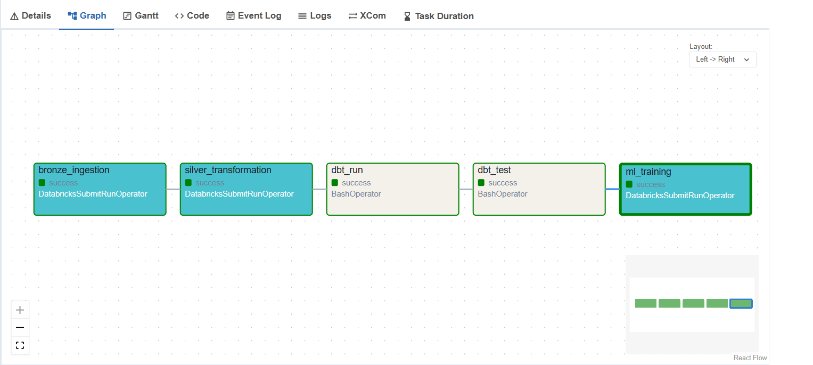

# Clinical Trials Analytics Platform
 
An end-to-end data engineering and machine learning platform for analyzing global clinical trial trends and predicting trial duration using the AACT database from ClinicalTrials.gov.
 
---
 
## Central Question
 
**Predicting clinical trial duration based on information available at the time of trial registration.**
 
Understanding how long a clinical trial will take is valuable for sponsors, regulators, and researchers — it informs resource planning, budgeting, and portfolio prioritization. By using only information known at registration (phase, sponsor type, enrollment size, number of facilities, disease area), we avoid data leakage and build a model that could realistically be used in practice.
 
---
 
## Architecture
 
```
AACT Raw Files (pipe-delimited .txt)
            ↓
    Databricks Volumes (raw storage)
            ↓
    Bronze Delta Tables (raw ingestion)
            ↓
    Silver Delta Tables (cleaned & typed)
            ↓
    dbt Gold Models (analytics-ready)
            ↓
    Spark ML + MLflow (duration prediction)
            ↓
    Predictions Delta Table
            ↓
    Apache Airflow (orchestrates all of the above end-to-end)
```
 
---
 
## Tool Stack
 
| Layer | Tool |
|---|---|
| Raw storage | Databricks Volumes |
| Cloud platform | Databricks |
| Orchestration | Apache Airflow |
| Processing | Databricks (PySpark) |
| Storage format | Delta Lake |
| Transformation | dbt |
| ML training | Spark ML |
| Experiment tracking | MLflow |
| Version control | GitHub |
 
---
 
## Dataset
 
**Source:** [AACT — Aggregate Analysis of ClinicalTrials.gov](https://aact.ctti-clinicaltrials.org)
 
AACT is a publicly available relational database containing all studies registered on ClinicalTrials.gov. It is updated daily and available as a free static download in pipe-delimited format. The database contains 587,788 trial records in total.
 
---
 
## Data Pipeline
 
### Bronze Layer
Raw files are ingested from Databricks Volumes into Delta tables with no transformations applied. All columns are retained as strings, preserving the source data exactly as received.
 
**Bronze tables:**
- `bronze_studies`
- `bronze_calculated_values`
- `bronze_conditions`
- `bronze_sponsors`
- `bronze_interventions`
- `bronze_facilities`
### Silver Layer
Bronze tables are cleaned, typed, and filtered. Key transformations include:
 
- Date columns cast from string to date type
- Numeric columns cast from string to integer or float
- Rows with null `nct_id` removed
- `minimum_age_num` null values filled with 0 (no lower age bound)
- `maximum_age_num` null values filled with 999 (no upper age bound)
- `has_age_restriction` flag derived: True when minimum > 0 or maximum < 999
- Lead sponsors filtered from the sponsors table (collaborators excluded)
**Silver tables:**
- `silver_studies`
- `silver_calculated_values`
- `silver_conditions`
- `silver_sponsors`
### Gold Layer (dbt)
Silver tables are transformed into analytics-ready models using dbt.
 
**Staging models:**
- `stg_studies`
- `stg_calculated_values`
**Mart models:**
- `dim_conditions`
- `dim_sponsors`
- `fact_trials`
**Feature models:**
- `gold_trial_features` — joined, enriched feature table used as ML input
---
 
## Feature Engineering & Modeling Decisions
 
### Target Variable
`actual_duration` (months) — the number of months from trial start date to completion date, as calculated by AACT.
 
Only trials with a non-null `actual_duration` are used for model training (~360,000 records).
 
### Features Used
 
| Feature | Source | Rationale |
|---|---|---|
| `phase` | studies | Strong structural predictor — Phase 3 trials are designed to be longer |
| `study_type` | studies | Interventional vs observational trials have different timelines |
| `agency_class` | sponsors | NIH-funded trials are significantly longer than industry-funded trials |
| `enrollment` | studies | Larger enrollment requires more time to recruit patients |
| `enrollment_type` | studies | Indicates whether enrollment is estimated or actual |
| `number_of_facilities` | calculated_values | More sites correlates with longer, more complex trials |
| `minimum_age_num` | calculated_values | Proxy for how targeted the patient population is |
| `maximum_age_num` | calculated_values | Combined with minimum age captures age restriction scope |
| `has_age_restriction` | derived | Whether the trial has any age eligibility criteria |
| `is_fda_regulated_drug` | studies | FDA-regulated trials face additional compliance requirements |
| `has_dmc` | studies | Data monitoring committees indicate higher-complexity trials |
 
### Leakage Considerations
 
**`were_results_reported` — excluded.** Whether results were reported is only known after trial completion and cannot be used to predict duration at registration time.
 
**`enrollment` when `enrollment_type = ACTUAL` — included with caveat.** Final enrollment numbers are only confirmed at trial completion, meaning they may carry mild leakage. However, since enrollment targets are set at registration and actual values rarely deviate dramatically, we include them and document this limitation. This decision prioritizes model coverage over strict purity.
 
**`number_of_facilities` — included with caveat.** The final number of participating facilities may change over the course of a trial. However, planned facility counts are typically submitted at registration, making this a reasonable proxy for planned trial scale.
 
---
 
## Machine Learning Results
 
Two regression models were trained to predict clinical trial duration (in months),
tracked with MLflow: **Linear Regression** and **Gradient Boosted Trees (GBT)**.
 
Both models were trained on a 70/15/15 train/validation/holdout split (235,325 /
50,380 / 50,275 rows respectively, from a filtered ML-ready dataset of 335,980 trials).
Hyperparameters were selected via manual grid search against the validation set, after
which each model was retrained on the combined train+validation data (282,753 rows)
before final evaluation on the untouched holdout set.
 
| Model | Holdout RMSE (months) | Holdout MAE (months) | Holdout R² |
|---|---|---|---|
| Linear Regression | 18.56 | 14.32 | 0.196 |
| **Gradient Boosted Trees** | **17.35** | **13.04** | **0.297** |
 
### Final Model Selection
 
GBT outperformed Linear Regression on every metric, on both the validation and holdout
sets, with no meaningful gap between validation and holdout performance for either
model — indicating neither model overfit during hyperparameter selection.
 
The R² of ~0.30 for GBT means the model explains roughly 30% of the variance in trial
duration. This is a modest but meaningful result: clinical trial duration is influenced
by many real-world factors not captured in registration-time metadata (e.g., actual
recruitment difficulty, unforeseen protocol amendments, site-level operational issues).
The model captures structural signal (phase, sponsor type, facility count, eligibility
criteria) without claiming to fully predict an inherently uncertain process.
 
The final production model is the **GBT Regressor** (`maxDepth=8`, `maxIter=50`).
 
### Leakage Investigation: Enrollment Type
 
As discussed in the Feature Engineering section, `enrollment` carries a documented
leakage caveat when `enrollment_type = ACTUAL` (final enrollment is typically only
confirmed at or near trial completion). To investigate this empirically, holdout
performance was broken out by `enrollment_type`:
 
| Enrollment Type | n (holdout) | RMSE | MAE | R² |
|---|---|---|---|---|
| ACTUAL | 47,447 | 17.29 | 12.99 | 0.299 |
| ESTIMATED | 2,088 | 18.69 | 14.15 | 0.262 |
| UNKNOWN | 224 | 17.57 | 13.14 | 0.140 |
 
ACTUAL rows showed modestly better performance than ESTIMATED rows (~8% lower RMSE).
This is consistent with either a mild leakage effect, or simply the ~22x larger training
sample available for ACTUAL rows (319k vs 14k in the full dataset) — and likely some
combination of both. The gap is too small relative to the sample size imbalance to
confidently attribute it to leakage alone. This result is reported transparently rather
than treated as confirmation of either explanation. The UNKNOWN group's R² is not
meaningful given its very small holdout sample (n=224).
 
### Model Comparison Note
 
The results showed consistent validation-to-holdout performance for both models — GBT
simply outperformed Linear Regression throughout, reflecting the underlying non-linear and
categorical-interaction structure of trial duration drivers that a linear model structurally
cannot capture.
 
---

## Pipeline Orchestration (Airflow)

The full pipeline — Bronze ingestion, Silver transformation, dbt run, dbt test, and ML
training — is orchestrated end-to-end with Apache Airflow, running locally via WSL2.

```
bronze_ingestion → silver_transformation → dbt_run → dbt_test → ml_training
```

Each Databricks notebook task is submitted via the Databricks Jobs API using Airflow's
`DatabricksSubmitRunOperator`, running on serverless compute. The two dbt tasks run as
local `BashOperator` shell commands against a dedicated Python environment.



### Why WSL2

Apache Airflow requires POSIX-compliant operating systems and does not run natively on
Windows (it depends on the `fcntl` module, which is Linux/macOS-only). Airflow runs
inside WSL2 (Windows Subsystem for Linux) with Ubuntu 24.04, while the project files
themselves remain on the Windows filesystem and are accessed from WSL2 via `/mnt/c/`.

### Why two separate Python environments

dbt and Airflow have incompatible dependency requirements (conflicting versions of
`click`, `protobuf`, and `sqlparse` in particular). Installing both into a single virtual
environment caused cascading dependency conflicts serious enough to break Airflow's CLI
entirely. The fix was to give each tool its own isolated virtual environment inside
WSL2 (`airflow-venv` and `dbt-venv`), with the DAG's `BashOperator` tasks explicitly
activating the dbt environment before running `dbt` commands. This mirrors a common
real-world pattern: tools with different dependency footprints are kept in separate
environments rather than forced to coexist.

### Why `DatabricksSubmitRunOperator` instead of `DatabricksNotebookOperator`

The more modern `DatabricksNotebookOperator` requires either an `existing_cluster_id` or
a `new_cluster` specification — it does not currently support serverless compute
(this is a [known, open limitation](https://github.com/apache/airflow/issues/45138) in
the Airflow Databricks provider as of this writing). Since Databricks Free Edition is
serverless-only, this operator could not be used here.

The older `DatabricksSubmitRunOperator` does support serverless, but only when the job
is submitted using the newer multi-task format (a `tasks` array with a `task_key`),
rather than the legacy single `notebook_task` parameter — the Databricks Jobs API
returns an explicit error directing you to this format when no cluster is specified.

---

## How to Run
 
### Prerequisites
- Databricks Free Edition account
- dbt Core installed locally
- Apache Airflow installed locally
### Setup
 
1. Clone the repository:
   ```bash
   git clone https://github.com/alexvalev/clinical-trials-analytics-platform.git
   cd clinical-trials-analytics-platform
   ```
 
2. Download the AACT pipe-delimited static copy from [aact.ctti-clinicaltrials.org/download](https://aact.ctti-clinicaltrials.org/download)
3. Upload the following files to your Databricks Volume at `/Volumes/clinical_trials/raw/clinical_trials_raw/`:
   - `studies.txt`
   - `calculated_values.txt`
   - `conditions.txt`
   - `sponsors.txt`
   - `interventions.txt`
   - `facilities.txt`
4. Run the Databricks notebooks in order:
   - `00_data_exploration`
   - `01_bronze_ingestion`
   - `02_silver_transformation`
   - `03_ml_training`
5. Run dbt:
   ```bash
   cd dbt/clinical_trials
   dbt run
   dbt test
   dbt docs generate
   ```
 
6. Trigger the Airflow DAG:
   ```bash
   cd airflow
   airflow dags trigger clinical_trials_pipeline
   ```
---
 
## Repository Structure

```
clinical-trials-analytics-platform/
├── notebooks/
│   ├── 00_exploration/
│   │   └── 00_data_exploration.ipynb
│   ├── 01_bronze/
│   │   └── 01_bronze_ingestion.ipynb
│   ├── 02_silver/
│   │   └── 02_silver_transformation.ipynb
│   └── 04_ml/
│       └── 04_ml_prediction.ipynb
├── dbt/
│   └── clinical_trials/
│       ├── dbt_project.yml
│       └── models/
│           ├── staging/      (stg_studies, stg_calculated_values)
│           ├── marts/        (dim_sponsors, dim_conditions, fact_trials)
│           └── features/     (gold_trial_features)
├── airflow/
│   └── dags/
├── images/
├── docs/
└── README.md
```

**Note on numbering:** The Gold layer is implemented entirely in dbt rather than as a
notebook — there is no `03_gold/` notebook folder. Notebook folders are numbered by
pipeline stage (Bronze → Silver → ML), with Gold modeling living in `dbt/` instead.